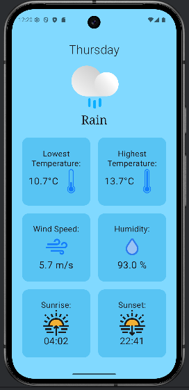

# 📦 Weather App

> Weather App for android that showcases the current weather and a 7-day forecast.

---

## 🧠 Table of Contents

- [About](#-about)
- [Features](#-features)
- [Screenshots](#-screenshots)
- [Screencast](#-screencast)
- [Documentation](#documentation)
- [Getting Started](#-getting-started)
- [Usage](#️-usage)
- [Tech Stack](#-tech-stack)
- [Known Issues](#-known-issues)
- [AI Usage](#ai-usage)
- [Contact](#-contact)

---

## 📖 About

This is a simple weather forecast app for Android. It provides the current weather and a 7-day forecast of a chosen location.

---

## ✨ Features

- ✅ **Ability on inspect current weather** including temperature, wind speed, humidity and more.
- ✅ **Provides a 7-day forecast** with weather details for each day.
- ✅ **Location selection** allows viewing weather from around the world.

---

## 📸 Screenshots

### Home Screen (Default view)


### Search Bar in Home Screen


### Details Screen


### Error Alert when Location Search Fails


---

## 🎦 Screencast

[Watch the Screencast here](https://youtu.be/6WbEyzMSEJc)

---

## Documentation

To generate the documentation, run:

```bash
    ./gradlew dokkaHtml
```

in the project root.


The generated documentation can be found in

```bash
WeatherApp/app/build/dokka/html/index.html
```

Open the index.html file in browser to see the documentation.


---

## 🚀 Getting Started

### Prerequisites

- Android Studio Meerkat | 2024.3.1 Patch 1 or newer
- JDK 21
- Android SDK installed (via Android Studio)
- Minimum Android API Level: 24
- Target Android API Level: 35

This project uses:
- **Jetpack Compose** UI
- **Retrofit** API calls
- **Gson** converter for Retrofit
- **ThreeTenABP** Date and time handling

APIs:
- **Open-Meteo API** for weather data.
- **OpenWeatherMap API** for geocoding.

### Installation


```bash
# Clone the repository
git clone https://github.com/JaninaMel/android-weatherapp

```
The Android weather app is located in the **WeatherApp** directory.
Open this folder in Android Studio to build and run the app.

Android Studio will automatically download and install all dependencies using Gradle.

---

## ⚙️ Usage

- **Running the app:**
    - Open the WeatherApp folder in Android Studio.
    - Usa an android device or select an emulator.
    - Click **Run** and the project should build and run.

---
### Dowloading and Installing the app on Mobile

In case you wish to try the app without building it yourself in Android Studio, download the latest .apk file release.

1. Go to the Releases section of this repository.
2. Download the .apk file from the most recent release.
3. If you didn't download the .apk file directly into your Android device, transfer it to your device from your computer.
4. Open the .apk file on your Android device and follow the installation prompt.

---

## 🧰 Tech Stack

- Language: Kotlin
- UI Framework: Jetpack Compose
- Networking: Retrofit
- JSON Parsing: Gson
- Date/Time: ThreeTenABP
- APIs:
     - Open-Meteo (Weather forecast data)
     - OpenWeatherMap (Geocoding)

---

## 🐞 Known Issues

-  City search: When searching for weather based on city name, due to the nature of how OpenWeatherMap's Geocoding API works, even if the input is not a clear city name (e. g. "A") the request will go through and an estimation of a city which might be in question is made. However this has been taken into account when updating the UI so the app will still show which city is in question.

- Api key: The api key is explicitly written in code instead of being in a .env file, however this has a minimal effect on security since the api key needs to be written out in the README in the repository if it's placed in a .env.

---

## AI Usage

- Used AI in solving API level problems when trying to use java.time. This can be seen in the following files: Util.kt, MyApp.kt.

- Also used AI to research geocoding and potential API options for the purpose. Effect of which can be seen in my decision to use OpenWeatherMap's Geocoding API.

---

## 📫 Contact

Project maintained by [Janina Elijoki](mailto:janina.elijoki@tuni.fi).
